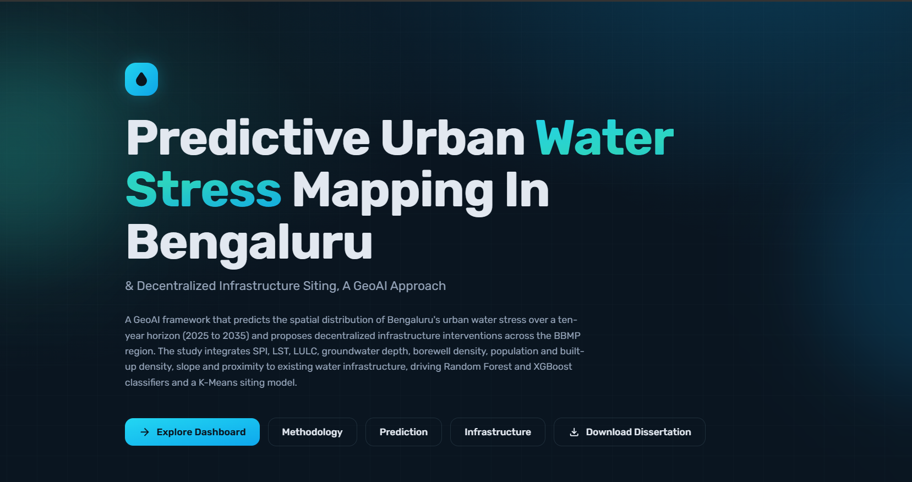
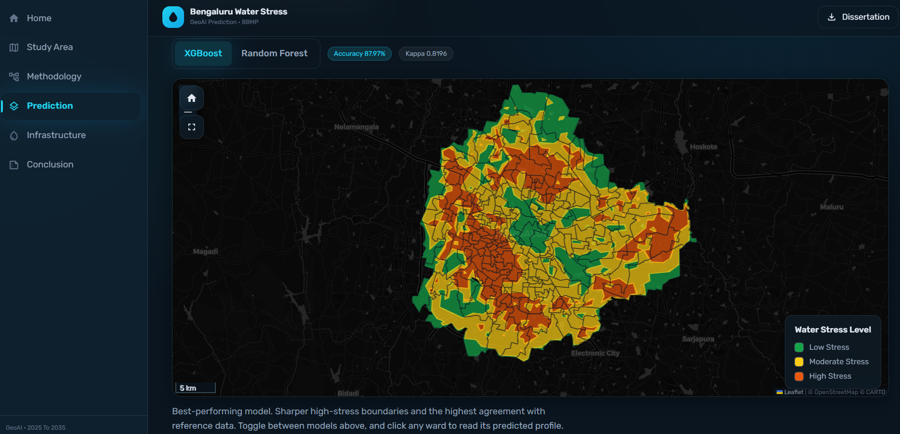
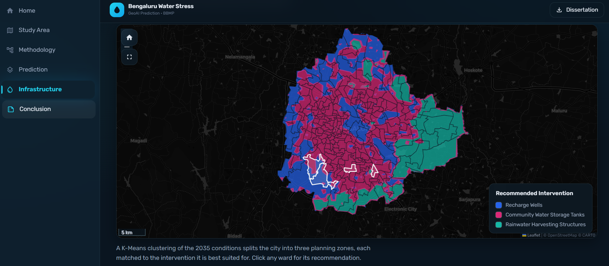

# Bengaluru's Urban Water Stress · GeoAI Web GIS Dashboard

Interactive Dashboard for the M.Sc. Geoinformatics Dissertation
**“Predictive Urban Water Stress Mapping and Decentralized Infrastructure
Siting in Bengaluru: A GeoAI Approach”** - Swapnanil Saha (Symbiosis Institute of Geoinformatics).

> A concise 6-section interactive Web GIS: Home, Study Area, Methodology,
> Prediction, Infrastructure and Conclusion. The Prediction and Infrastructure
> maps are vectorised from the classified Rasters and are fully interactive (Model Toggle, Clickable Wards).





## Run Locally

```bash
npm install
npm run dev      # http://localhost:5173
```

## Build for Production

```bash
npm run build    # outputs to dist/
npm run preview  # preview the production build
```

## Tech Stack

React 18 · Vite · TypeScript · Tailwind CSS · React Router · Framer Motion ·

## Project Structure

```
src/
  data/         # single source of truth — every number from the dissertation
  components/   # layout shell + reusable UI (GlassCard, KpiCard, ...)
  pages/        # one file per route
  hooks/        # useCountUp, ...
  styles/       # theme + globals
public/assets/  # web-optimized figures (maps, charts, diagrams)
```

## Interactive Map Data

The Study Area page (`/study-area`) runs a Leaflet Web GIS built from the real data:

- `public/assets/geo/bbmp-wards.geojson` — 225 BBMP wards, Choropleth by 2011-Census Population Density, (Click for full Census Popup, Searchable by Name).
- `public/assets/geo/borewells.geojson` — 7,438 BWSSB Borewells (Clustered).
- `public/assets/geo/pumping-stations.geojson` — 30 Pumping Stations.
- `public/assets/geo/waterlines.geojson` — BWSSB Water Pipeline Network.

Controls: basemap switch (dark/satellite/streets/terrain), layer toggles + ward
opacity, legend, scale bar, north arrow, live coordinates, distance measure,
home, fullscreen, PNG export and print. Converted from your KML/GeoJSON to
web-optimized GeoJSON (268 MB of KML/shape → ~2 MB).

## Notes

- Original ArcGIS layouts (≈268 MB) were re-encoded to WebP (≈4 MB total) for the web.

